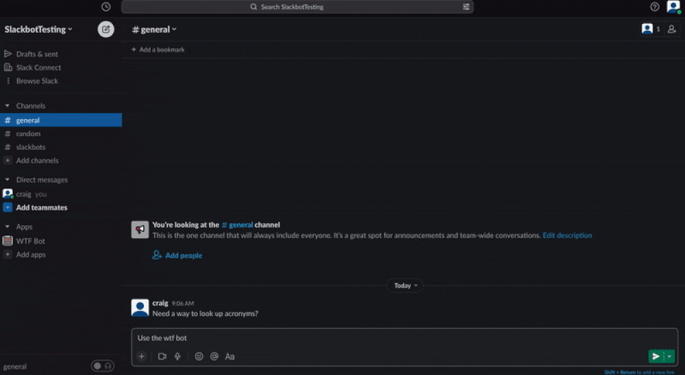

<!-- README LOGO -->
 

  

  <h1 align="center">WTF Bot</h1>

  

    A slackbot that returns acronym definitions by typing a command followed by the acronym. 
    <!-- <a href=""><strong>Some link »</strong></a> -->
      
  

  

  
  
